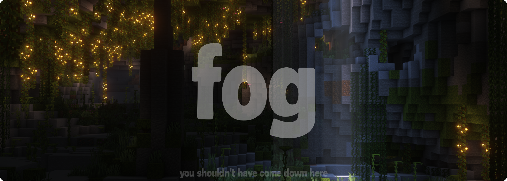
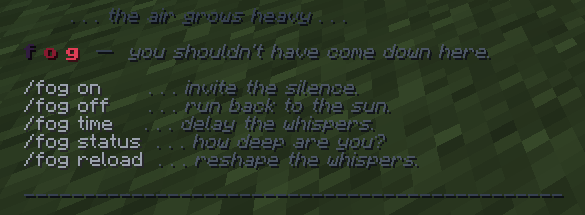

# f o g



A moody PaperMC plugin that turns underground mining into a quiet, introspective, and slightly unsettling journey. It completely strips away flashy particles to focus on isolation, soundscapes, and raw psychological depth.

---

## The Concept

As players descend deeper into the earth, the world slowly changes. FOG tracks player depth in real-time and triggers subtle atmospheric changes depending on their current zone:

* **Shallow (Y: 59 to 30)**: Warm nostalgic thoughts, gentle cave echoes, and the quiet comfort of a furnace.
* **Deep (Y: 29 to 0)**: Heavy silence, deep reflections on why we keep digging, and distant machinery.
* **Abyss (Y: -1 and below)**: Existential dread, raw cavern echoes, and sudden **10-second warden blindness**.

---

## Features

### 1. Pure Isolation (Zero Particles)
There are no floating bubbles, colorful dusts, or flashy indicators. The atmosphere is built purely on ambient sound cues, raw text, and sensory deprivation.

### 2. Warden Darkness
When an atmospheric trigger occurs in the Abyss, the player is struck with a pure, black **Darkness** effect for **10 seconds** (200 ticks), simulating a warden passing by in the dark.

### 3. No-Repeat Message Pools
To prevent spam, the plugin tracks which thoughts a player has already experienced during their current zone visit. It will never show the same text twice until they leave the zone (which resets their history). If a player has seen everything in a zone, the whispers fade to absolute silence.

### 4. UI
The help and status interfaces are designed with a retro psychological horror aesthetic:
* Spaced lowercase styling.
* A custom Adventure color gradient for the `f o g` title (shifting from indigo `#311D3F` through blood crimson `#881A30` to pale red `#E23E57`).
* Unified silent prefixes (`f o g »`) for all status and error messages.

---



## Commands

* `/fog on`  
  Enables the atmospheric engine. Warns you if it is already active.
* `/fog off`  
  Disables the atmospheric engine. Returns you to standard vanilla silence.
* `/fog status`  
  Shows your current depth, zone, intervals, and active atmospheres.
* `/fog time <shallow|deep|abyss> <seconds>`  
  Dynamically changes and persists trigger intervals directly to `config.yml` in real-time.
* `/fog reload`  
  Reloads the config file instantly without requiring a server reboot.

---

## Configuration (`config.yml`)

The configuration is extremely clean. You can add or modify thoughts and sounds for each depth zone:

```yaml
depth:
  shallow: 59
  deep: 29
  abyss: -1

intervals:
  shallow: 120
  deep: 300
  abyss: 600

atmospheres:
  shallow_thoughts:
    zone: shallow
    messages:
      - "some things just take time, but i don't mind waiting. it's warm near the furnace."
      - "i don't restart worlds because they're bad. i restart them because i miss beginnings."
    sounds:
      - "minecraft:ambient.cave"

  deep_reflections:
    zone: deep
    messages:
      - "i mined for hours and found no diamonds but i didn't really fail i just forgot i was looking for coal"
    sounds:
      - "minecraft:ambient.cave"
      - "minecraft:block.portal.ambient"

  abyss_echoes:
    zone: abyss
    messages:
      - "you feel like seeing village torches in the distance after walking through darkness for too long"
    sounds:
      - "minecraft:entity.warden.ambient"
```

---

## Requirements & Build

* **Platform**: PaperMC 1.21.1+
* **Java**: Version 21
* **Build tool**: Maven

### How to install:
1. Put `fog-1.0.0.jar` into your server's `plugins/` directory.
2. Restart or reload the server.
3. Dive deep and start mining.